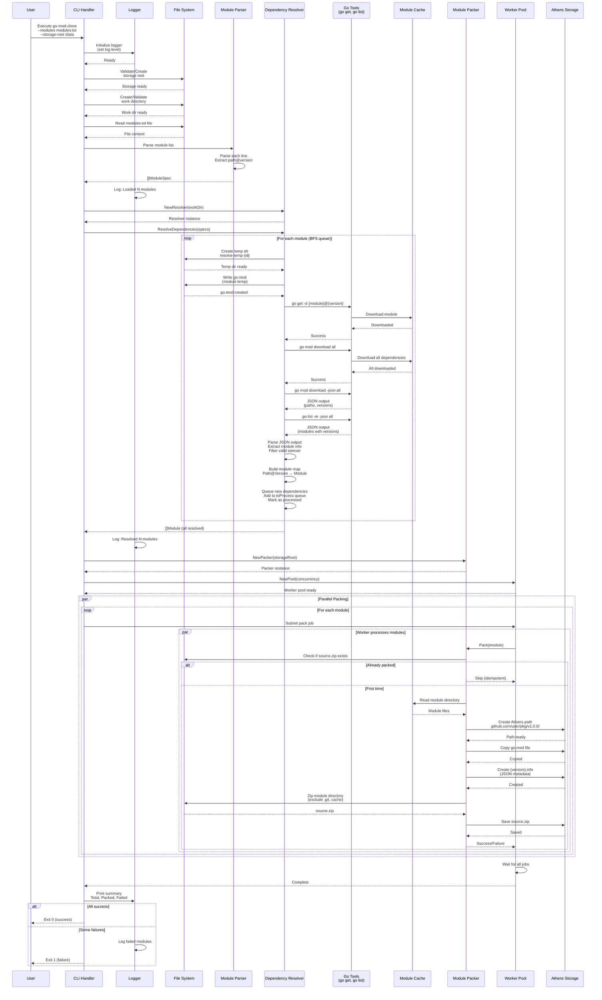
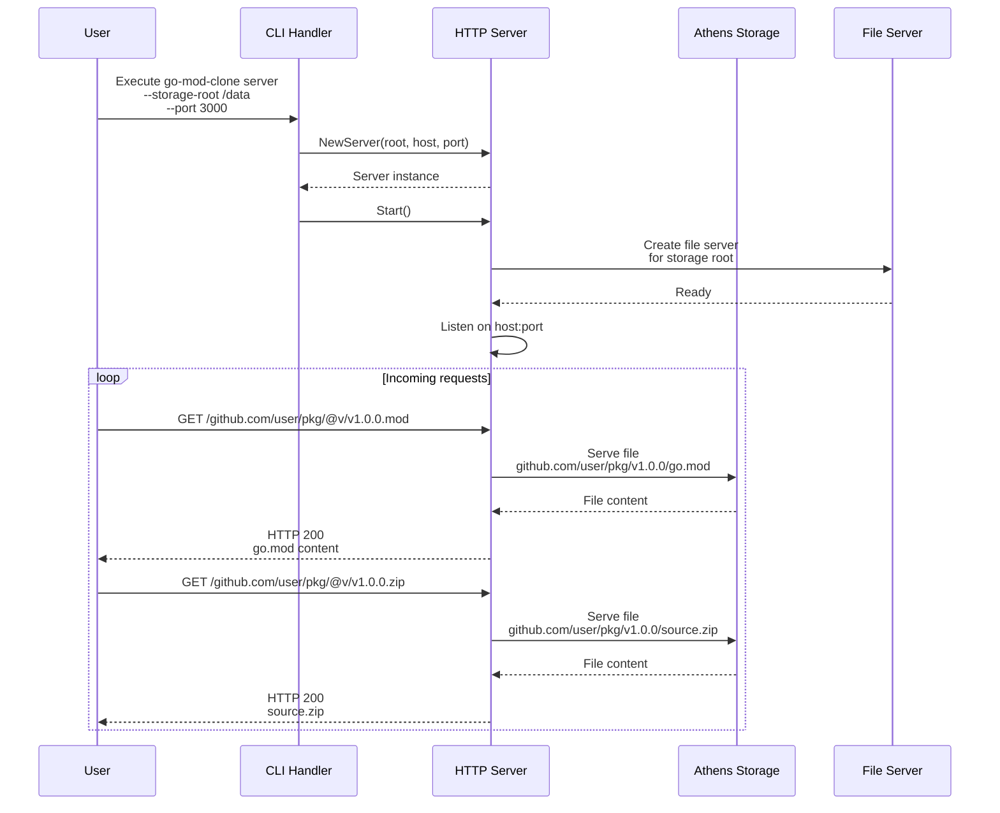
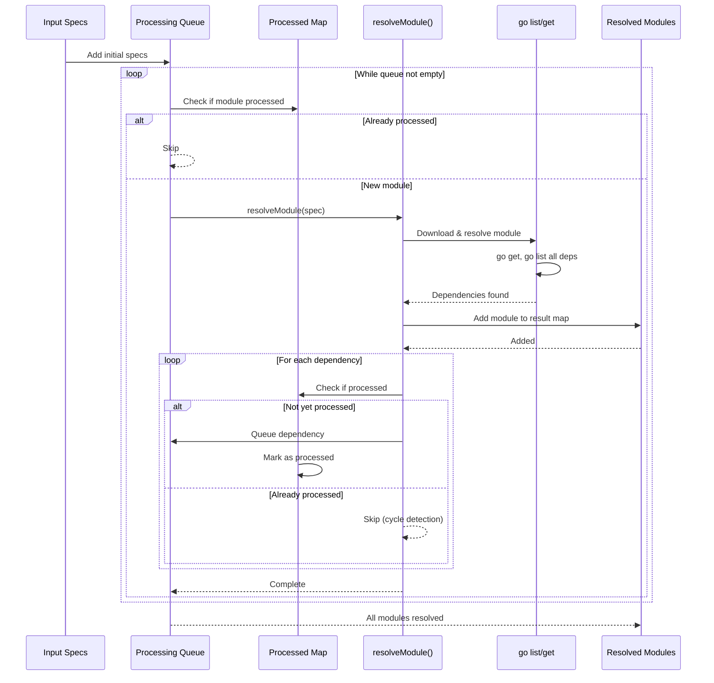
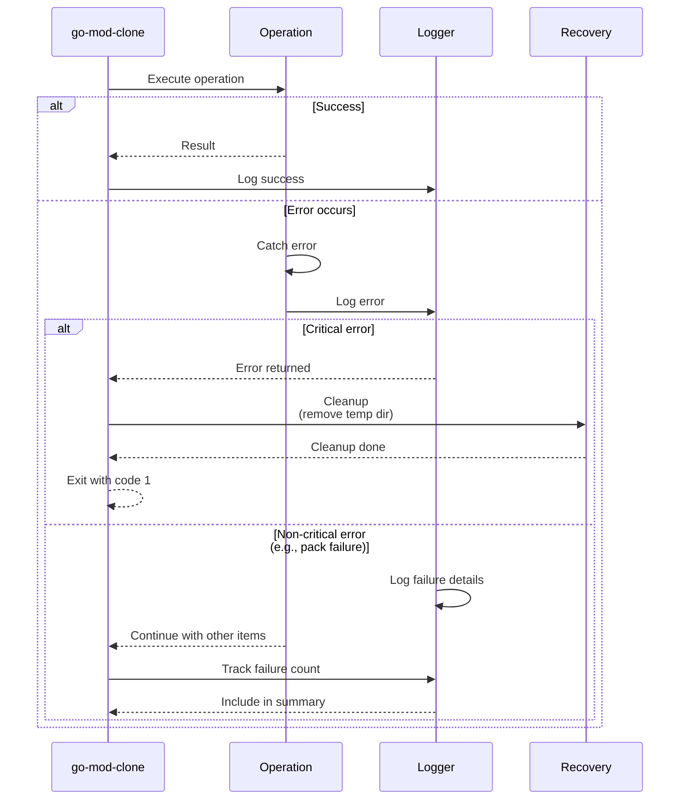

# Go Module Clone - Flow Sequence Diagram

## Main Workflow Sequence

## Server Mode Workflow

## Dependency Resolution Detail (Recursive BFS)

## Error Handling Flow

---

## Process Summary

### Main Command Flow
1. **Initialization**: Setup logger, storage, work directory
2. **Parsing**: Read and parse modules.txt
3. **Dependency Resolution**: Use go tools to resolve all transitive dependencies
4. **Parallel Packing**: Pack modules into Athens format using worker pool
5. **Summary**: Report results with success/failure counts

### Key Features
- **Recursive Resolution**: BFS approach finds all transitive dependencies
- **Parallel Processing**: Worker pool speeds up packing (default 4 workers)
- **Idempotent**: Skips already-packaged modules
- **Error Resilience**: Continues on individual pack failures, reports summary
- **Server Mode**: Serves packaged modules as HTTP Go module proxy
- **Concurrency**: Thread-safe with mutexes protecting shared state
